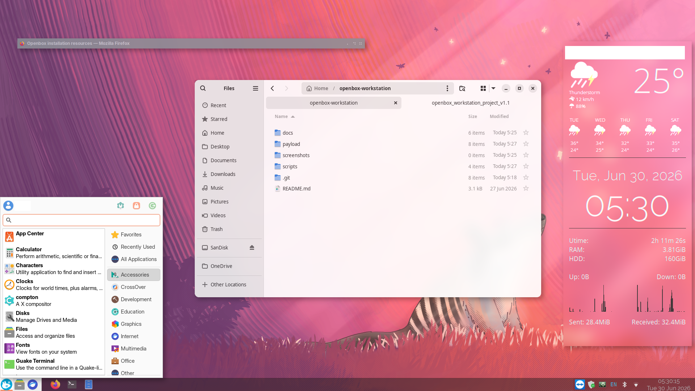
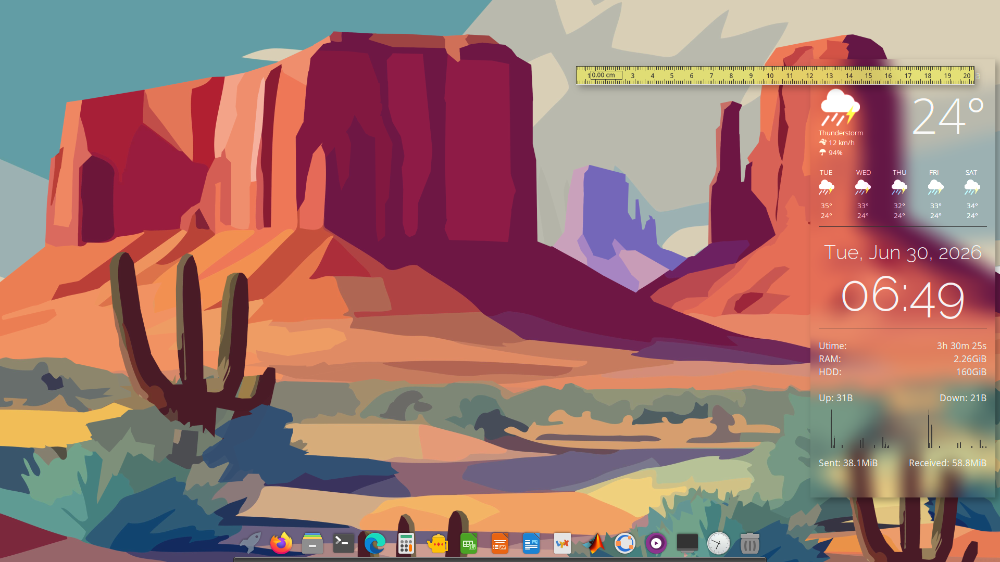

# Openbox Workstation

*A lightweight, elegant and fully functional Openbox desktop environment for Ubuntu, Fedora and other Linux distributions.*

---

## Overview

Openbox Workstation is a curated Openbox desktop environment designed for users who prefer a lightweight, responsive and distraction-free Linux workstation.

The project builds upon the Ubuntu Community Hub tutorial:

**"[2026] A Beautiful, Minimal and Workable Openbox-based Session on New & Old Machines"**

by **sbnwl**

https://discourse.ubuntu.com/t/2026-a-beautiful-minimal-and-workable-openbox-based-session-on-new-old-machines/84392

Rather than redesigning the original work, this project preserves its philosophy while introducing carefully evaluated improvements that enhance usability, maintainability and long-term reliability.

---

## Features

- Lightweight, fast and responsive Openbox desktop
- Elegant, distraction-free workspace
- Two complete desktop layouts
    - Desktop Layout A – Traditional panel
    - Desktop Layout B – Dock and launcher
- Desktop information board with clock, weather and system information
- Integrated application launcher
- Automatic wallpaper management
- Smooth desktop compositing
- Integrated Bluetooth, network and power management
- Universal multimedia key support
- Modern Inter font family
- Built with lightweight, modular components
- Carefully documented for long-term maintainability

---

## Design Goals

- Functionality before aesthetics
- Lightweight and responsive
- Modular desktop components
- Minimal external dependencies
- Preserve the original work whenever practical
- Incremental, well-documented evolution

---

## Documentation

| Document           | Purpose                                              |
| ------------------ | ---------------------------------------------------- |
| `README.md`        | Project overview and features                        |
| `INSTALL.md`       | Installation and setup guide                         |
| `WELCOME.txt`      | Post-installation quick start and keyboard shortcuts |
| `WORKSTATION.md`   | Workstation architecture and desktop layouts         |
| `COMPONENT-MAP.md` | Component relationships and responsibilities         |
| `CHANGELOG.md`     | Version history                                      |
| `DESIGN.md`        | Design philosophy and guiding principles *(future)*  |

---

## Credits

### Original Project

This project is based on the Ubuntu Community Hub tutorial:

**"[2026] A Beautiful, Minimal and Workable Openbox-based Session on New & Old Machines"**

**Original Contributor** / Developer: sbnwl

Version **1.0** preserves the original work as the reference implementation.

Openbox Workstation **v1.1** builds upon that foundation through improvements while keeping the original architecture and philosophy.

---

## License

This project preserves attribution to the original author wherever applicable.

Please refer to the following project license for redistribution, modification and attribution terms.

Copyright (C) 2026 Surendra Beniwal

    Openbox Workstation is licensed under the GNU General Public License 
    v3.0 or later (GPL-3.0-or-later). See the LICENSE file for details.
    This program is free software: you can redistribute it and/or modify
    it under the terms of the GNU General Public License as published by
    the Free Software Foundation, either version 3 of the License, or
    (at your option) any later version.

    This program is distributed in the hope that it will be useful,
    but WITHOUT ANY WARRANTY; without even the implied warranty of
    MERCHANTABILITY or FITNESS FOR A PARTICULAR PURPOSE.  See the
    GNU General Public License for more details.

    You should have received a copy of the GNU General Public License
    along with this program.  If not, see <https://gnu.org>.

